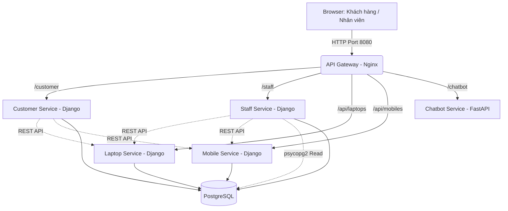

# 🛒 Nova Electronics (AI-Ecommerce Microservices)

Dự án Hệ thống E-commerce hiện đại tích hợp trợ lý ảo Trí tuệ Nhân tạo (AI Chatbot). Hệ thống được bóc tách hoàn toàn theo mô hình **Microservices Architecture**, sử dụng Docker Compose để quản lý vòng đời container. Nó bao gồm hệ thống bán lẻ, phân tích hành vi người dùng bằng Machine Learning và trả lời tự động bằng LLM (Đại mô hình ngôn ngữ).

---

## 🏛 Tổng quan Kiến trúc (Architecture)

Mọi lưu lượng truy cập (Traffic) từ trình duyệt đều đi qua **API Gateway (Nginx)** để định tuyến đến đúng Microservice bảo mật ẩn bên trong mạng nội bộ Docker (`kiemtra01_0106_duongnt_default`). 



### 🔁 Giao tiếp liên Service (Inter-service Communication)
* **Frontend Web (Browser):** Tương tác với hệ thống qua các domain được định tuyến bởi API Gateway.
* **REST API:** `Customer Service` và `Staff Service` sử dụng thư viện `requests` gọi API nội bộ tới `Laptop Service` (`http://laptop-service:8000/api/...`) và `Mobile Service` để fetch dữ liệu catalog chung.
* **Cross-DB Connection:** `Staff Service` được cấu hình dùng thư viện quản lý kết nối `psycopg2` chọc thẳng sang `customer_db` để truy vấn danh sách account khách mua hàng (Tính năng phân mảnh quyền giới hạn - Read Replica Simulation).

---

## 🧩 Chức năng các Microservices

Hệ thống được chia thành 6 container chính:

### 1. Nginx API Gateway (`api-gateway`)
*   **Chức năng:** Điểm vào duy nhất (Single Entry-point) cho toàn bộ ứng dụng. Bảo vệ các service phía sau không bị phơi ra internet. Xử lý đường dẫn ảo dồn về port 8080.
*   **Định hướng:** `/customer/*`, `/staff/*`, `/chatbot/*`, `/api/laptops/*`, `/api/mobiles/*`.

### 2. Customer Service (`customer-service`)
*   **Công nghệ:** Django.
*   **Chức năng:** Giao diện cho người tiêu dùng (B2C). Xử lý đăng nhập khách hàng, hiển thị trang chủ, giỏ hàng (Cart) session. Phục vụ Widget Chatbot UI tích hợp góc dưới bên phải trang.
*   **Database:** `customer_db`.

### 3. Staff Service (`staff-service`)
*   **Công nghệ:** Django.
*   **Chức năng:** Panel Quản trị (Admin Dashboard). Hiển thị biểu đồ phân tích (Chart.js), quản lý kho nội bộ (Internal Inventory), theo dõi danh sách khách hàng và xem các catalog.
*   **Database:** `staff_db`.

### 4. Laptop Service & Mobile Service (`laptop-service`, `mobile-service`)
*   **Công nghệ:** Django.
*   **Chức năng:** Service chuyên rẽ nhánh phục vụ dữ liệu. Chạy hoàn toàn độc lập với các DB độc lập. Nó chỉ cung cấp 2 tính năng: Trang quản trị mặc định (Django Admin) để nhập liệu và Cung cấp RESTful API xuất danh sách thiết bị.
*   **Database:** `laptop_db`, `mobile_db`.

### 5. AI Chatbot Service (`chatbot-service`)
*   **Công nghệ:** FastAPI, NumPy, Groq SDK.
*   **Chức năng:** Đầu não AI của hệ thống.
    *   Sử dụng **Ngữ cảnh bổ sung (RAG)** in-memory để nhúng thông tin Laptop/Mobile vào câu hỏi.
    *   Sử dụng mạng nơ-ron thuần `numpy` để **phân loại hành vi khách hàng** (Budget Buyer, Gamer, Tech Enthusiast, v.v.).
    *   Truyền tải đến **Llama-3.3-70b-versatile via Groq** để sinh phản hồi ngôn ngữ tự nhiên. 
    *   Có chế độ **High-Availability Fallback**, nhả text cứng nếu LLM sập mạng.

### 6. Central Database (`postgres-db`)
*   Cơ sở dữ liệu tập trung sử dụng PostgreSQL.
*   Giai đoạn `docker-entrypoint-initdb.d/init.sql` sẽ tự động tạo lập 4 logical schema độc lập lập tương đương với 4 cơ sở dữ liệu riêng: `customer_db`, `staff_db`, `laptop_db`, `mobile_db`. Các service không đụng chạm bảng chiếu của nhau.

---

## 🔌 Cấu hình Port & Networking

| Container / Service | Port Mạng Internal | Port Ánh xạ ra ngoài Host (Public) |
| :--- | :--- | :--- |
| `api-gateway` (Nginx) | 80 | **8080** |
| `postgres-db` | 5432 | **5432** |
| `customer-service` | 8000 | Không lộ ra ngoài |
| `staff-service` | 8000 | Không lộ ra ngoài |
| `laptop-service` | 8000 | Không lộ ra ngoài |
| `mobile-service` | 8000 | Không lộ ra ngoài |
| `chatbot-service` | 8000 | Không lộ ra ngoài |

*(Bạn chỉ cần duy nhất cổng 8080 để duyệt toàn bộ ứng dụng).*

---

## 🔑 Tài khoản Default (Demo)

Khi lần đầu chạy hệ thống và áp dụng migrate, hãy sử dụng các tài khoản sau (Giả định):

*   **Tài khoản Khách mua hàng:**
    *   Route: [http://localhost:8080/customer/](http://localhost:8080/customer/)
    *   Username: `customer`
    *   Password: `123456`

*   **Tài khoản Quản lý (Staff):**
    *   Route: [http://localhost:8080/staff/](http://localhost:8080/staff/)
    *   Username: `staff`
    *   Password: `123456`

---

## 🚀 Hướng dẩn Vận hành (Getting Started)

Mọi thao tác thay đổi ở bất cứ Microservice nào đều yêu cầu build lại Image.

### Chạy hệ thống:
Mở Terminal ở thư mục chứa file `docker-compose.yml`:
```bash
# Build và bật tất cả service trong background
docker compose up -d --build --force-recreate
```

### Xem log theo dõi (Đặc biệt hữu ích xem AI Chatbot phân tích):
```bash
# Xem log toàn hệ thống
docker compose logs -f

# Xem log riêng hệ thống Chatbot
docker compose logs -f chatbot-service
```

### Dọn dẹp hệ thống:
```bash
# Tắt và xóa toàn bộ các container, network
docker compose down

# Xóa kèm cả database volumes (Reset dữ liệu sạch)
docker compose down -v
```

---
*Created by: Tung Duong (Môn: Kiến trúc & Thiết kế Phần mềm - SAD).*
